<h1 align="center">Hi 👋, I'm Val</h1>
<h3 align="center">A self-taught and experiment-driven developer from Switzerland</h3>

- 🔨 Currently working on **[lintspec](https://github.com/beeb/lintspec)**
- 🌱 I’m currently learning **[nix](https://nixos.org/)**
- 💬 Ask me about **rust, svelte/kit, web3, solidity, python**
- 📫 How to reach me **hi@beeb.li**
- ⚡ Fun fact **Gruyère cheese doesn't have holes**
- 📝 I sometimes write on **[beeb.li](https://beeb.li/blog)**

### Connect with me

- [Mastodon](https://hachyderm.io/@beeb)
- [LinkedIn](https://linkedin.com/in/vbersier)
- [CodeBerg](https://codeberg.org/beeb)

### Languages and Tool

&nbsp;

